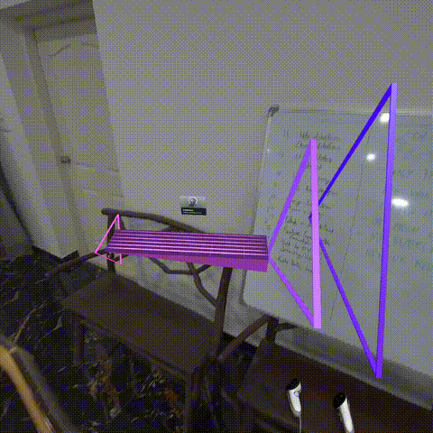

# RizzRiff

RizzRiff is an interactive application designed to help guitarists of all levels improve their playing skills. This Unity-based project combines real-time pitch detection, visual fretboard representation, and gamified learning to create an engaging and effective guitar practice experience.



## Table of Contents
- [RizzRiff](#rizzriff)
  - [Table of Contents](#table-of-contents)
  - [Features](#features)
  - [Demo Video](#demo-video)
  - [Installation](#installation)
  - [Usage](#usage)
  - [Components](#components)
  - [Contributing](#contributing)
  - [License](#license)

## Features

- **Real-time pitch detection**: Accurately detects the notes you play on your guitar.
- **Visual fretboard**: Displays notes and frets on a virtual guitar neck for easy reference.
- **Multiple practice modes**: Includes scales, chords, and custom song modes.
- **Gamified learning**: Earn points and track your progress as you practice.
- **Customizable difficulty**: Adjust the game's difficulty to match your skill level.
- **Built-in tuner**: Ensure your guitar is always in tune with the integrated tuning feature.
- **Performance analytics**: Track your progress over time with detailed statistics and charts.

## Demo Video

[Insert your demo video here]

## Installation

1. Clone the repository:
   ```
   git clone https://github.com/saurabhchalke/RizzRiff.git
   ```
2. Open the project in Unity (version 2022.3 or later).
3. Build the project for your desired platform (Windows, macOS, or Linux).

## Usage

1. Launch the RizzRiff application.
2. Connect your guitar to your computer using an audio interface or microphone.
3. Select a practice mode from the main menu.
4. Follow the on-screen instructions to start playing and improving your guitar skills.

## Components

The RizzRiff project consists of several key components:

- `FretboardMovement.cs`: Manages the visual representation of the guitar fretboard.
- `NoteSpawner.cs`: Generates notes for the player to play based on the selected mode.
- `NoteDetector.cs`: Handles real-time pitch detection of played notes.
- `GuitarTuner.cs`: Provides an integrated guitar tuning feature.
- `NoteBehaviour.cs`: Controls the behavior of individual note objects.
- `StringVibration.cs`: Simulates string vibration effects for visual feedback.

## Contributing

We welcome contributions to the RizzRiff project! If you'd like to contribute, please follow these steps:

1. Fork the repository.
2. Create a new branch for your feature or bug fix.
3. Make your changes and commit them with descriptive commit messages.
4. Push your changes to your fork.
5. Submit a pull request to the main repository.

Please ensure your code follows the existing style and includes appropriate tests.

## License

This project is licensed under the GNU General Public License v3.0. See the [LICENSE](LICENSE) file for details.

---

For more information, please contact Saurabh Chalke, the maintainer.